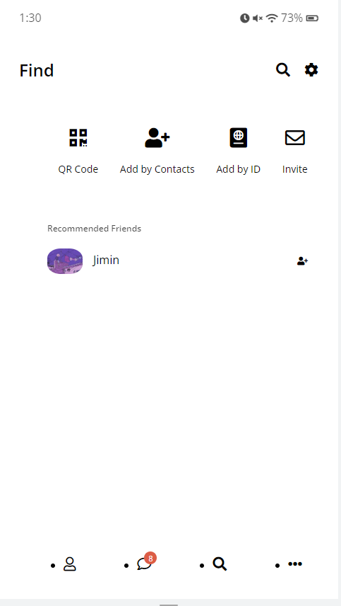
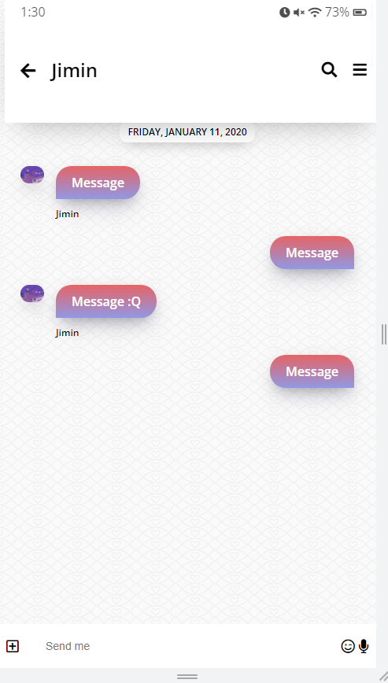
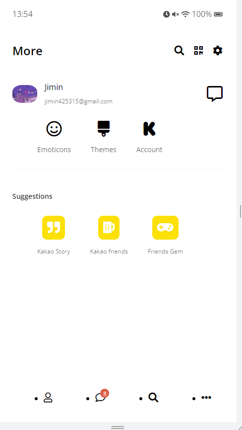

# kakao_clone

## kakaotalk clone with html and css

카카오톡 어플리케이션 화면 구상 코드입니다. :)

## Summary

## 🔗Link

[GitHub - FeelingXD/Kakao-Clone](https://github.com/FeelingXD/Kakao-Clone)

## 🖇️ Summary

---

```
🐳 -  html 과 css 만으로 카카오톡 페이지 화면 구현 프로젝트 입니다.

- fontawesome i 태그로 커스텀 문자 UI 사용
- Css flex, 화면 레이아웃 구성등 복습

```

## 사용 기술

---

- Html
- Css

## 이미지

---

<div style="display:flex">
     <div style="flex:1;padding-right:10px;">
          
     </div>
     <div style="flex:1;padding-left:10px;">
          
     </div>
     <div style="flex:1;padding-left:10px;">
          
     </div>
     <div style="flex:1;padding-left:10px;">
          
     </div>
</div>
